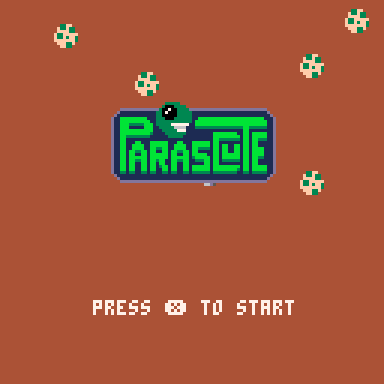
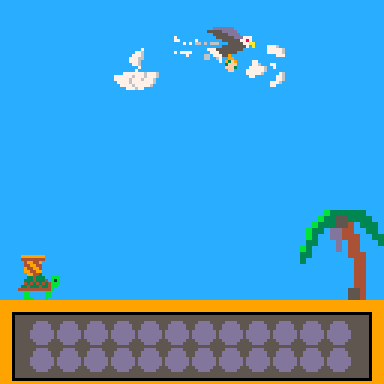

# Parascute
Parascute is a 2D game about turtle eggs that have been snatched by an evil eagle. The player is a tortoise that must catch the falling eggs and save them from a fatal fall.

# Controls
- Left and Right arrow keys to move around

# Rules
The rules are simple: save as many eggs as you can!

To do so, follow along with the flying eagle and catch the eggs it drops. But be careful, sometimes the eagle will drop rocks to break the eggs you have already caught in your basket.

# About
The project is meant to be a learning project. The main focuses for this game are to improve my competence in basic music composition and learning to implement an *Entity Component System* pattern.

I wat to give a shoutout to the amazing [PICO 8 Music Theory for Programmers](https://bikibird.itch.io/music-theory) tutorial series by [bikibird](https://bikibird.itch.io/). Their practical tutorial has been a great resource to learn the very basics of making music using PICO-8.

I also want to take the opportunity to mention the youtube series [Developing an Open-World Adventure Game in Pico-8](https://www.youtube.com/playlist?list=PLQaniv5ve2yh6PGgw_Pg7OE6dDLVhpxAA) by [Rick Cross](https://www.youtube.com/@RikCross) which showcases an easy to follow implementation of the *Entity Component System* pattern.

## Technical notes
the game is developed in PICO-8. This allows me to create all the required assets in a single cohesive environment. More information on the PICO-8 fantasy console can be found on official (PICO-8 website)[https://www.lexaloffle.com/pico-8.php]